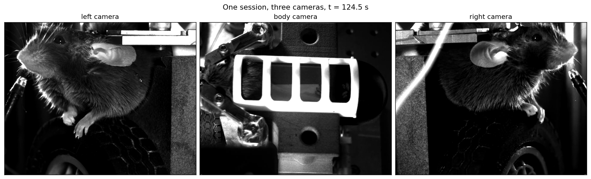

# asyncvideo

Async video reader with fast random frame access.

Video files are compressed, and that compression has two practical consequences:

1. **Decoding an arbitrary frame is non-trivial.** Frames are not stored independently, so you cannot simply jump to a frame and read it — getting the *right* frame out means dealing with how the stream is encoded.
2. **Decoding is computationally intensive**, which limits the frame rate a single process can sustain. This becomes a problem when you stream more than one video at a time.

`asyncvideo` takes on both.

**`VideoHandler`** makes reading one frame, or many, as simple as slicing an array:

```python
from asyncvideo import VideoHandler
from asyncvideo.fetch import fetch_times, fetch_video

with VideoHandler(fetch_video("left"), pixel_format="rgb24") as video:
    print(video.shape)               # (601, 1024, 1280, 3) — frames, height, width, RGB

    frame = video[420]               # one frame, by number
    clip = video[100:200:10]         # a strided range
    crop = video[0:100, 0:64, 0:64]  # frames, plus a spatial crop

# or by time in seconds, using the timestamps the acquisition system recorded
with VideoHandler(
    fetch_video("left"), time=fetch_times("left"), pixel_format="rgb24"
) as video:
    at_time = video.get(124.5)
    window = video.get_slice(124.5, 125.0)   # a time range -> a slice
    half_second = video[window]
```

Every snippet here runs as written. `fetch_video` and `fetch_times` download a short clip
of a real multi-camera recording on first use — see [Example data](#example-data). Reading
your own files needs nothing extra.

**`AsyncVideoReader`** streams several videos in parallel. It runs one decoder process per open video and returns a `Future` instead of blocking, so the streams decode concurrently. Frames are indexed the same way, one at a time:

```python
from asyncvideo import AsyncVideoReader
from asyncvideo.fetch import fetch_video

# three cameras filming the same session
readers = [AsyncVideoReader(fetch_video(cam)) for cam in ("left", "body", "right")]

# every video starts decoding at once;
# the futures are returned immediately, before the frames are available
futures = [r[100] for r in readers]

# result() waits for the frame
frames = [f.result() for f in futures]

for r in readers:
    r.shutdown()
```

## Overview

The two readers exist for different jobs.

**`VideoHandler` is for analysis and inspection.** You have a recording, and something computed from it: per-frame classifier labels, tracking points, scored behavioural epochs. For a concrete example, you want to look at the frames a result refers to. Say you have the start and end times of mouse grooming bouts — you want the frames for one bout, as an array, to check them or plot them. `VideoHandler` lets you index and slice a video by frame number or by time, and hands back numpy arrays.

**`AsyncVideoReader` is for multi-view display.** Decoding is expensive, so showing several videos at the same time — a multi-camera rig, for instance — needs more than one decoder. `AsyncVideoReader` gives each video its own process and returns futures, so the streams decode in parallel and the displaying thread never waits on any single one of them.

Because the jobs differ, so do the APIs:

| | `VideoHandler` | `AsyncVideoReader` |
|---|---|---|
| Returns | frames, immediately | a `Future` |
| Decodes in | the calling thread | a separate process, one per reader |
| Frames per request | one, or a slice of many | **one only** |
| Indexing | `[i]`, `[i:j:k]`, `[-1]`, spatial crop | `[i]` |
| By timestamp | `get`, `get_slice` | `get` |
| Your own timestamps | `time=` | `time=` |
| Pixel format | `pixel_format=` | always native; use `to_rgb` |
| Array attributes | `shape`, `frame_shape`, `time`, `dtype`, `ndim`, `len()` | `shape`, `time`, `dtype`, `ndim` |
| Best for | scripts, analysis, batch work | interactive UIs, sliders, live display |

Two behaviours of `AsyncVideoReader` worth knowing before you use it:

- **It returns one frame per request.** The shared-memory buffer holds a single frame, so a slice does not fetch a range. Results also keep a leading axis of length 1, so a converted frame is `(1, H, W, 3)` and displaying it means taking `[0]`.
- **It supersedes in-flight requests.** If a new frame is requested while an older request is still decoding, the old one is cancelled. Dragging a slider therefore stays responsive, because the reader does not work through a backlog of frames that are no longer needed.

Each reader owns a process, so remember to call `shutdown()` when you are done with it.

### Analysis: the frames for a behavioural epoch

Frame times rarely start at zero or fall on an exact grid, so pass `time=` — one timestamp per frame, from the acquisition system — and every lookup uses your clock rather than a frame rate guessed from the container:

```python
from asyncvideo import VideoHandler
from asyncvideo.fetch import fetch_times, fetch_video

bout_start, bout_end = 124.0, 125.0   # a scored behavioural epoch, in session time

with VideoHandler(
    fetch_video("left"), time=fetch_times("left"), pixel_format="rgb24"
) as video:
    window = video.get_slice(bout_start, bout_end)
    bout = video[window]                 # (n_frames, height, width, 3)

    print(bout.shape)                    # (60, 1024, 1280, 3)
    print(video.time[window])            # the timestamp of each frame returned
```

Note the timestamps do not start at zero: this clip was cut from two minutes into the
session, and its `time` array says so. That is what acquisition timestamps look like, and
passing them as `time=` is what lets you ask for 124.0 s directly.

Video and other recorded signals — spike times, a behavioural trace — can then be indexed by the same number, without converting between clocks at every call.

Note that `get_slice` returns a `slice`, not the frames. This is deliberate: a time range says nothing about how many frames it covers, so slicing straight by time risks materialising an enormous array. Ten minutes of 640x480 video at 30 fps is 18,000 frames, which is 16.6 GB as `rgb24`. Returning the slice first lets you inspect what you asked for before deciding to read it:

```python
window = video.get_slice(120.0, 130.0)      # the whole clip, ten seconds of it
print(window.stop - window.start)           # check the size before reading

bout = video[window]                        # nothing is decoded until this line
```

### Multi-view: several cameras at once

Issue every request before collecting any result. That is what makes the decodes overlap rather than run one after another:

```python
from asyncvideo import AsyncVideoReader
from asyncvideo.fetch import fetch_video

readers = [AsyncVideoReader(fetch_video(cam)) for cam in ("left", "body", "right")]
try:
    futures = [r[100] for r in readers]          # all three decode at the same time
    # to_rgb converts the reader's YUV output for display (see Pixel formats below)
    views = [r.to_rgb(f.result())[0] for r, f in zip(readers, futures)]
finally:
    for r in readers:
        r.shutdown()
```

Showing one frame from three cameras therefore costs about as much as showing it from the slowest one, rather than the sum of all three.

In practice the cameras have their own timestamps and need not share a frame rate, so one moment in the experiment is a *different frame index* in each view. Ask by time instead and there is no index to map:

```python
from asyncvideo import AsyncVideoReader
from asyncvideo.fetch import fetch_times, fetch_video

# each camera gets its own clock, so one timestamp means the same instant in all three
readers = {
    cam: AsyncVideoReader(fetch_video(cam), time=fetch_times(cam))
    for cam in ("left", "body", "right")
}
try:
    futures = {cam: r.get(124.5) for cam, r in readers.items()}
    views = {cam: readers[cam].to_rgb(f.result())[0] for cam, f in futures.items()}
finally:
    for r in readers.values():
        r.shutdown()
```

The three cameras run at 60, 30 and 150 fps, so `t = 124.5 s` is frame **271**, **135** and **677** respectively — the arithmetic you would otherwise be doing by hand.



[`examples/ibl_multiview.py`](examples/ibl_multiview.py) is a runnable version of this against a public [International Brain Laboratory](https://www.internationalbrainlab.com) session that records three cameras at 60, 30 and 150 fps. It needs the docs extra (`pip install -e ".[docs]"`) and downloads a few megabytes of example clips on first run.

## Example data

Every snippet above runs against short clips of a real recording, downloaded on first use by `asyncvideo.fetch` and cached locally. They are three cameras filming one mouse at 60, 30 and 150 fps, ten seconds each, about 10 MB in total. Reading your own videos needs none of this — `pooch` and `tqdm` come with the docs extra and are only used to fetch the examples.

```python
from asyncvideo.fetch import available_examples, fetch_times, fetch_video

available_examples()          # ('left', 'body', 'right')
fetch_video("left")           # path to the clip
fetch_times("left")           # its per-frame timestamps, in seconds
```

Set `ASYNCVIDEO_DATA_DIR` to choose where they are cached.

The data is derived from public data of the [International Brain Laboratory](https://www.internationalbrainlab.com), licensed [CC-BY 4.0](https://creativecommons.org/licenses/by/4.0/) and **modified** — each clip is ten seconds taken from a recording several hours long, with its timestamps sliced to match. It is not covered by this package's MIT licence. If you use it, please cite [IBL et al. (2025)](https://www.nature.com/articles/s41586-025-09235-0) and the [technical paper](https://doi.org/10.6084/m9.figshare.21400815). `asyncvideo.fetch.DATA_ATTRIBUTION` carries the full notice.


## Installation

```bash
pip install asyncvideo
```

Requires Python 3.11 or newer. The only dependencies are [numpy](https://numpy.org) and [PyAV](https://pyav.org), which provides the FFmpeg bindings — PyAV ships binary wheels for common platforms, so a system FFmpeg install is usually not needed.

For development, including the test suite:

```bash
git clone https://github.com/BalzaniEdoardo/asyncvideo
cd asyncvideo
pip install -e ".[dev]"
nox -s video_gen   # generate the test videos
nox -s tests
```

## Pixel formats and converting to RGB

`pixel_format` controls what you get back, and the choice is a real trade-off:

| `pixel_format` | You get | Notes |
|---|---|---|
| `None` (default) | `av.VideoFrame` | No conversion at all — cheapest |
| `"rgb24"` | `(H, W, 3)` uint8 | What plotting libraries expect |
| `"yuv420p"` | packed `(H * 3 // 2, W)` uint8 | Half the bytes of RGB |
| `"yuv444p"` | `(3, H, W)` uint8 | Full-resolution chroma |

YUV is more compact than RGB because the colour channels are stored at reduced resolution — `yuv420p` carries a frame in half the bytes of `rgb24`. When frames are being moved around rather than looked at (between processes, over a network, into a GPU texture that samples YUV directly) that is a real saving, and it is why `AsyncVideoReader` uses YUV for its shared-memory transfer.

The drawback is that plotting libraries do not accept YUV. To display a frame, convert it with `to_rgb`:

```python
import matplotlib.pyplot as plt
from asyncvideo import VideoHandler
from asyncvideo.fetch import fetch_video

with VideoHandler(fetch_video("left"), pixel_format="yuv420p") as video:
    plt.imshow(video.to_rgb(video[7]))
```

The reader's `to_rgb` knows which format it was configured with, so you never repeat it. There is also a module-level function, for arrays that have outlived their reader:

```python
from asyncvideo import to_rgb

to_rgb(frame)                              # av.VideoFrame, or a list of them
to_rgb(planes)                             # (Y, U, V) tuple from AsyncVideoReader
to_rgb(packed)                             # packed yuv420p array
to_rgb(arr, from_format="yuv444p")         # (3, H, W) must be named explicitly
```

Conversion is done by libav through PyAV rather than by a hand-written matrix, so the colour coefficients and range used are the ones FFmpeg would use for that stream.

A single `yuv444p` frame is `(3, H, W)`, which is indistinguishable from a stack of three packed `yuv420p` frames — hence `from_format` for that one case. The method form never needs it.

### One shape caveat

With the default `pixel_format=None`, `shape` reports the layout of `frame.to_ndarray()` in the stream's *native* format. For a 1024x1280 `yuv420p` video that is `(n, 1536, 1280)`, because the packed layout stacks the colour planes underneath the luma plane. `frame_shape` is `(1024, 1280)` either way:

```python
from asyncvideo import VideoHandler
from asyncvideo.fetch import fetch_video

with VideoHandler(fetch_video("left")) as video:   # pixel_format=None
    print(video.shape)        # (601, 1536, 1280)  — packed Y + U + V
    print(video.frame_shape)  # (1024, 1280)       — actual frame size
```

## Supported formats

Support means *covered by the test suite*. `VideoHandler` is tested against every combination below; `AsyncVideoReader` is currently tested against H.264 in MP4 only.

| Codec | Container |
|---|---|
| H.264 (`libx264`) | `.mp4`, `.mkv` |
| H.265 (`libx265`) | `.mp4` |
| MPEG-4 (`mpeg4`) | `.mp4`, `.avi` |
| VP9 (`vp9`) | `.webm` |

Other codecs may work, since nothing here is codec-specific, but they are not verified. Codecs whose packet order differs from display order are the most likely to have seeking problems. AV1 is known not to work correctly yet. If you need a format that is not listed, please open an issue with a sample file.

## License

MIT — see [LICENSE](LICENSE).
